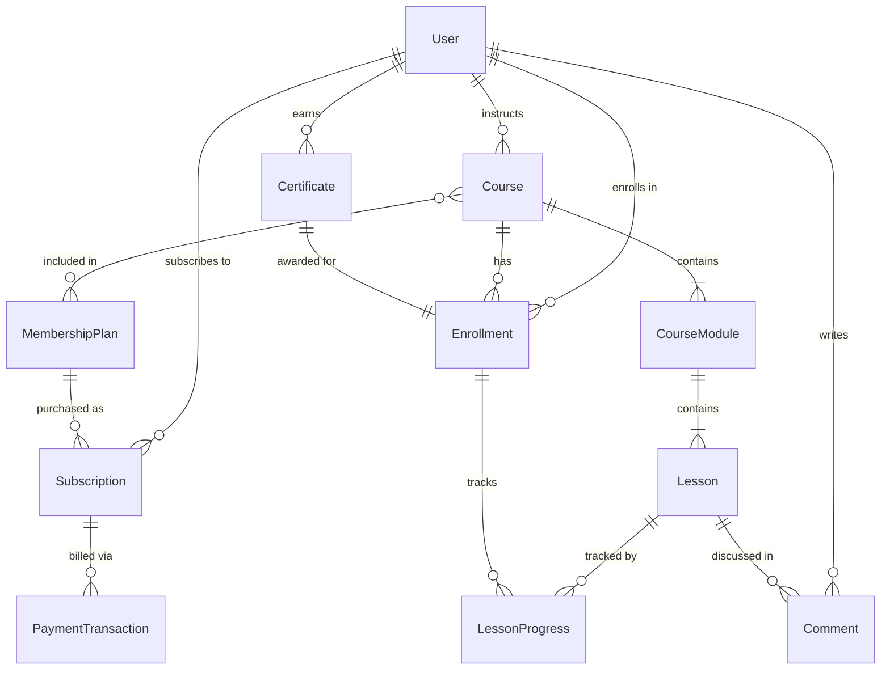

# Design Document — GrowthPedia Platform

## Overview

GrowthPedia is an online learning platform built as a modular monolith using Laravel (backend) and React (frontend) connected via Inertia.js in a monorepo structure. The platform enables Instructors to create structured courses, Learners to consume content via subscriptions, and Admins to manage users, content, and analytics.

The architecture follows a domain-driven modular monolith pattern where each business domain (Course, Subscription, User, etc.) is encapsulated in its own Laravel module with clear boundaries. Inertia.js bridges Laravel and React, eliminating the need for a separate API layer while delivering a single-page app experience.

### Key Design Decisions

1. **Inertia.js over REST API**: Since the frontend is tightly coupled to the backend (same team, same deploy), Inertia.js provides server-driven routing with React rendering — simpler than maintaining a separate API.
2. **Modular Monolith over Microservices**: A single deployable unit with internal module boundaries. Each module owns its models, services, controllers, and migrations. Modules communicate through well-defined service interfaces, not direct model access.
3. **Payment Gateway Abstraction**: Payment processing is abstracted behind an interface to support multiple gateways (Stripe, Midtrans) without coupling business logic to a specific provider.
4. **Event-Driven Side Effects**: Domain events (e.g., `LessonCompleted`, `SubscriptionActivated`) decouple modules. The Progress module listens for lesson events; the Certificate module listens for completion events.

## Architecture

### High-Level Architecture

```mermaid
graph TB
    subgraph "Client (Browser)"
        React["React + Inertia.js Client"]
    end

    subgraph "Laravel Application"
        Inertia["Inertia.js Middleware"]
        
        subgraph "Modules"
            CourseModule["Course Module"]
            LessonModule["Lesson Module"]
            SubscriptionModule["Subscription Module"]
            ProgressModule["Progress Module"]
            CertificateModule["Certificate Module"]
            DiscussionModule["Discussion Module"]
            UserModule["User Module"]
            PaymentModule["Payment Module"]
            AdminModule["Admin Module"]
            CatalogModule["Catalog Module"]
        end

        EventBus["Laravel Event Bus"]
    end

    subgraph "External Services"
        PaymentGW["Payment Gateway (Stripe/Midtrans)"]
        MailService["Mail Service (SMTP)"]
        FileStorage["File Storage (S3/Local)"]
    end

    subgraph "Data Layer"
        DB[(PostgreSQL)]
        Cache[(Redis)]
        Queue["Queue Worker (Redis)"]
    end

    React -->|HTTP/Inertia| Inertia
    Inertia --> CourseModule
    Inertia --> LessonModule
    Inertia --> SubscriptionModule
    Inertia --> ProgressModule
    Inertia --> CertificateModule
    Inertia --> DiscussionModule
    Inertia --> UserModule
    Inertia --> AdminModule
    Inertia --> CatalogModule

    CourseModule --> EventBus
    LessonModule --> EventBus
    SubscriptionModule --> EventBus
    ProgressModule --> EventBus
    CertificateModule --> EventBus

    PaymentModule --> PaymentGW
    UserModule --> MailService
    CertificateModule --> FileStorage

    CourseModule --> DB
    SubscriptionModule --> DB
    ProgressModule --> DB
    UserModule --> DB
    CatalogModule --> Cache
    SubscriptionModule --> Queue
    PaymentModule --> Queue
```



### Module Boundaries

Each module follows this internal structure:

```
app/Modules/{ModuleName}/
├── Controllers/
├── Models/
├── Services/
├── Actions/          # Single-purpose action classes
├── DTOs/             # Data Transfer Objects
├── Events/
├── Listeners/
├── Requests/         # Form Request validation
├── Policies/         # Authorization policies
├── Exceptions/
├── Routes/
│   └── web.php
└── Tests/
```

### Module Communication Rules

- Modules MUST NOT directly access another module's Eloquent models.
- Modules communicate through **Service Interfaces** (contracts) registered in the service container.
- Side effects across modules are handled via **Laravel Events** dispatched to the event bus.
- Shared value objects and DTOs live in a `app/Shared/` namespace.

## Components and Interfaces

### Module Service Interfaces

```php
// app/Modules/Course/Contracts/CourseServiceInterface.php
interface CourseServiceInterface
{
    public function createCourse(CreateCourseDTO $dto): CourseDTO;
    public function updateCourse(int $courseId, UpdateCourseDTO $dto): CourseDTO;
    public function publishCourse(int $courseId): CourseDTO;
    public function unpublishCourse(int $courseId): void;
    public function addModule(int $courseId, CreateModuleDTO $dto): ModuleDTO;
    public function addLesson(int $moduleId, CreateLessonDTO $dto): LessonDTO;
    public function getCourseWithStructure(int $courseId): CourseDetailDTO;
    public function deleteLessonFromPublishedCourse(int $lessonId): void;
}

// app/Modules/Subscription/Contracts/SubscriptionServiceInterface.php
interface SubscriptionServiceInterface
{
    public function subscribe(int $userId, int $planId, PaymentTokenDTO $token): SubscriptionDTO;
    public function cancel(int $subscriptionId): void;
    public function changePlan(int $subscriptionId, int $newPlanId): SubscriptionDTO;
    public function hasActiveSubscription(int $userId): bool;
    public function getUserPlanCourseIds(int $userId): array;
    public function handleRenewal(int $subscriptionId): SubscriptionDTO;
    public function suspendExpired(int $subscriptionId): void;
}

// app/Modules/Progress/Contracts/ProgressServiceInterface.php
interface ProgressServiceInterface
{
    public function markLessonComplete(int $userId, int $lessonId): ProgressDTO;
    public function getCourseProgress(int $userId, int $courseId): CourseProgressDTO;
    public function getNextLesson(int $userId, int $courseId): ?LessonDTO;
    public function recalculateForCourse(int $courseId): void;
}

// app/Modules/Certificate/Contracts/CertificateServiceInterface.php
interface CertificateServiceInterface
{
    public function generateCertificate(int $userId, int $courseId): CertificateDTO;
    public function verifyCertificate(string $verificationCode): ?CertificateDTO;
    public function downloadPdf(int $certificateId): StreamedResponse;
    public function getUserCertificates(int $userId): Collection;
}

// app/Modules/Payment/Contracts/PaymentGatewayInterface.php
interface PaymentGatewayInterface
{
    public function charge(PaymentRequestDTO $request): PaymentResultDTO;
    public function refund(string $transactionId, int $amount): RefundResultDTO;
    public function verifyWebhookSignature(string $payload, string $signature): bool;
    public function retryCharge(PaymentRequestDTO $request, int $maxRetries = 3): PaymentResultDTO;
}

// app/Modules/Discussion/Contracts/DiscussionServiceInterface.php
interface DiscussionServiceInterface
{
    public function createComment(int $userId, int $lessonId, string $content): CommentDTO;
    public function replyToComment(int $userId, int $parentCommentId, string $content): CommentDTO;
    public function editComment(int $userId, int $commentId, string $newContent): CommentDTO;
    public function flagComment(int $flaggedBy, int $commentId, string $reason): void;
    public function getThreadForLesson(int $lessonId, int $page): PaginatedCommentsDTO;
}

// app/Modules/User/Contracts/UserServiceInterface.php
interface UserServiceInterface
{
    public function register(RegisterDTO $dto): UserDTO;
    public function verifyEmail(string $token): bool;
    public function assignRole(int $userId, string $role): UserDTO;
    public function suspendUser(int $userId): void;
    public function searchUsers(string $query, int $page): PaginatedUsersDTO;
    public function lockAccount(int $userId, int $minutes): void;
}

// app/Modules/Admin/Contracts/AnalyticsServiceInterface.php
interface AnalyticsServiceInterface
{
    public function getDashboardMetrics(DateRangeDTO $range): DashboardMetricsDTO;
    public function getCourseAnalytics(int $courseId): CourseAnalyticsDTO;
    public function exportCsv(DateRangeDTO $range): StreamedResponse;
    public function getFlaggedComments(int $page): PaginatedFlaggedCommentsDTO;
}

// app/Modules/Catalog/Contracts/CatalogServiceInterface.php
interface CatalogServiceInterface
{
    public function browse(int $page, ?string $category, ?string $sortBy): PaginatedCoursesDTO;
    public function search(string $query, int $page): PaginatedCoursesDTO;
    public function getCourseDetail(int $courseId): CatalogCourseDetailDTO;
}
```

### Domain Events

```php
// Key domain events that drive cross-module communication
class LessonCompleted       // → ProgressModule listens, updates tracker
class CourseCompleted        // → CertificateModule listens, generates cert
class SubscriptionActivated  // → UserModule listens, grants access
class SubscriptionSuspended  // → UserModule listens, revokes access
class PaymentSucceeded       // → SubscriptionModule listens, activates sub
class PaymentFailed          // → SubscriptionModule listens, starts grace period
class CommentFlagged         // → NotificationModule listens, emails author
class LessonRemovedFromCourse // → ProgressModule listens, recalculates
class UserRegistered         // → sends verification email
class AccountLocked          // → sends lock notification email
```

### React Frontend Structure

```
resources/js/
├── Pages/
│   ├── Auth/           # Login, Register, ForgotPassword, VerifyEmail
│   ├── Course/         # CourseDetail, LessonView, CourseCreate, CourseEdit
│   ├── Catalog/        # CatalogIndex, SearchResults
│   ├── Dashboard/      # LearnerDashboard, InstructorDashboard
│   ├── Subscription/   # Plans, Checkout, ManageSubscription
│   ├── Certificate/    # MyCertificates, VerifyCertificate
│   ├── Discussion/     # (embedded in LessonView)
│   └── Admin/          # UserManagement, Analytics, ContentReview
├── Components/
│   ├── Course/         # LessonPlayer, ModuleList, ProgressBar
│   ├── Discussion/     # CommentThread, CommentForm, FlagButton
│   ├── Subscription/   # PlanCard, PaymentForm
│   ├── UI/             # Shared UI components (Button, Modal, Pagination)
│   └── Layout/         # AppLayout, AdminLayout, GuestLayout
├── Hooks/              # Custom React hooks (useProgress, useSubscription)
├── Types/              # TypeScript interfaces mirroring backend DTOs
└── Utils/              # Helpers, formatters, validators
```


## Data Models

### Entity Relationship Diagram



### Core Models

#### User
| Field | Type | Constraints |
|-------|------|-------------|
| id | bigint (PK) | auto-increment |
| name | varchar(255) | required |
| email | varchar(255) | unique, required |
| password | varchar(255) | hashed, required |
| role | enum('learner','instructor','admin') | default: 'learner' |
| email_verified_at | timestamp | nullable |
| is_suspended | boolean | default: false |
| failed_login_attempts | int | default: 0 |
| locked_until | timestamp | nullable |
| created_at | timestamp | |
| updated_at | timestamp | |

#### Course
| Field | Type | Constraints |
|-------|------|-------------|
| id | bigint (PK) | auto-increment |
| instructor_id | bigint (FK → users) | required |
| title | varchar(255) | required |
| description | text | required |
| category | varchar(100) | required |
| status | enum('draft','published','unpublished') | default: 'draft' |
| published_at | timestamp | nullable |
| created_at | timestamp | |
| updated_at | timestamp | |

#### CourseModule
| Field | Type | Constraints |
|-------|------|-------------|
| id | bigint (PK) | auto-increment |
| course_id | bigint (FK → courses) | required |
| title | varchar(255) | required |
| sort_order | int | required |
| created_at | timestamp | |
| updated_at | timestamp | |

#### Lesson
| Field | Type | Constraints |
|-------|------|-------------|
| id | bigint (PK) | auto-increment |
| course_module_id | bigint (FK → course_modules) | required |
| title | varchar(255) | required |
| content_type | enum('text','video','mixed') | required |
| content_body | text | nullable (for text/mixed) |
| video_url | varchar(500) | nullable (for video/mixed) |
| sort_order | int | required |
| created_at | timestamp | |
| updated_at | timestamp | |

#### MembershipPlan
| Field | Type | Constraints |
|-------|------|-------------|
| id | bigint (PK) | auto-increment |
| name | varchar(255) | required |
| description | text | nullable |
| price | decimal(10,2) | required, >= 0 |
| billing_frequency | enum('monthly','yearly') | required |
| is_active | boolean | default: true |
| created_at | timestamp | |
| updated_at | timestamp | |

#### CourseMembershipPlan (Pivot)
| Field | Type | Constraints |
|-------|------|-------------|
| course_id | bigint (FK → courses) | |
| membership_plan_id | bigint (FK → membership_plans) | |
| (composite PK) | | |

#### Subscription
| Field | Type | Constraints |
|-------|------|-------------|
| id | bigint (PK) | auto-increment |
| user_id | bigint (FK → users) | required |
| membership_plan_id | bigint (FK → membership_plans) | required |
| status | enum('active','grace_period','suspended','cancelled') | required |
| starts_at | timestamp | required |
| ends_at | timestamp | required |
| grace_period_ends_at | timestamp | nullable |
| cancelled_at | timestamp | nullable |
| gateway_subscription_id | varchar(255) | nullable |
| created_at | timestamp | |
| updated_at | timestamp | |

#### PaymentTransaction
| Field | Type | Constraints |
|-------|------|-------------|
| id | bigint (PK) | auto-increment |
| subscription_id | bigint (FK → subscriptions) | required |
| gateway_transaction_id | varchar(255) | required |
| amount | decimal(10,2) | required |
| currency | varchar(3) | default: 'IDR' |
| status | enum('success','failed','refunded','pending') | required |
| type | enum('charge','renewal','refund','proration') | required |
| metadata | json | nullable |
| created_at | timestamp | |

#### Enrollment
| Field | Type | Constraints |
|-------|------|-------------|
| id | bigint (PK) | auto-increment |
| user_id | bigint (FK → users) | required |
| course_id | bigint (FK → courses) | required |
| enrolled_at | timestamp | required |
| completion_percentage | decimal(5,2) | default: 0.00 |
| completed_at | timestamp | nullable |
| created_at | timestamp | |
| updated_at | timestamp | |
| (unique) | | user_id + course_id |

#### LessonProgress
| Field | Type | Constraints |
|-------|------|-------------|
| id | bigint (PK) | auto-increment |
| enrollment_id | bigint (FK → enrollments) | required |
| lesson_id | bigint (FK → lessons) | required |
| completed_at | timestamp | nullable |
| created_at | timestamp | |
| (unique) | | enrollment_id + lesson_id |

#### Certificate
| Field | Type | Constraints |
|-------|------|-------------|
| id | bigint (PK) | auto-increment |
| enrollment_id | bigint (FK → enrollments) | unique, required |
| user_id | bigint (FK → users) | required |
| course_id | bigint (FK → courses) | required |
| verification_code | varchar(64) | unique, required |
| learner_name | varchar(255) | required (snapshot) |
| course_title | varchar(255) | required (snapshot) |
| completed_at | timestamp | required |
| pdf_path | varchar(500) | nullable |
| created_at | timestamp | |

#### Comment
| Field | Type | Constraints |
|-------|------|-------------|
| id | bigint (PK) | auto-increment |
| lesson_id | bigint (FK → lessons) | required |
| user_id | bigint (FK → users) | required |
| parent_comment_id | bigint (FK → comments) | nullable (for nesting) |
| content | text | required |
| is_flagged | boolean | default: false |
| flag_reason | varchar(255) | nullable |
| flagged_by | bigint (FK → users) | nullable |
| is_edited | boolean | default: false |
| edited_at | timestamp | nullable |
| created_at | timestamp | |
| updated_at | timestamp | |


## Correctness Properties

*A property is a characteristic or behavior that should hold true across all valid executions of a system — essentially, a formal statement about what the system should do. Properties serve as the bridge between human-readable specifications and machine-verifiable correctness guarantees.*

### Property 1: Course creation preserves all input data

*For any* valid course creation DTO (with non-empty title, description, and category), calling `createCourse` SHALL return a CourseDTO with a unique identifier and all input fields matching the provided values.

**Validates: Requirements 1.1**

### Property 2: Structural ordering is preserved

*For any* course with modules and lessons, the modules SHALL be returned in their specified `sort_order`, and lessons within each module SHALL be returned in their specified `sort_order`.

**Validates: Requirements 1.2, 1.3, 2.5**

### Property 3: Course visibility follows publish status

*For any* set of courses with varying statuses (draft, published, unpublished), the course catalog SHALL return only courses with status `published`. Publishing a draft course SHALL make it appear in the catalog, and unpublishing SHALL remove it from the catalog while preserving all enrollment and progress data.

**Validates: Requirements 1.5, 1.7, 12.1**

### Property 4: Lesson completion advances progress correctly

*For any* course with N total lessons and a learner who has completed M lessons, completing an additional lesson SHALL update the completion percentage to `(M+1) / N * 100` and the next incomplete lesson in module sequence SHALL become accessible.

**Validates: Requirements 2.2, 5.1, 5.2**

### Property 5: Subscription-based access control

*For any* user and any published course, the user SHALL have access to the course content if and only if the user has an active subscription to a membership plan that includes that course. Users without an active subscription SHALL be denied access to subscription-gated content.

**Validates: Requirements 2.3, 2.4**

### Property 6: Membership plan creation stores all fields

*For any* valid membership plan DTO (with name, description, price, billing frequency, and course set), creating the plan SHALL persist all fields and the plan SHALL be retrievable with all values matching the input.

**Validates: Requirements 3.1**

### Property 7: Plan updates do not affect existing subscriptions

*For any* membership plan with active subscriptions, updating the plan's price or course set SHALL apply changes only to new subscriptions created after the update. Existing subscriptions SHALL retain their original terms until renewal.

**Validates: Requirements 3.2**

### Property 8: Deactivated plans reject new subscriptions

*For any* deactivated membership plan, new subscription attempts SHALL be rejected. Existing active subscriptions on that plan SHALL continue to function until their current billing period ends.

**Validates: Requirements 3.3**

### Property 9: Grace period is exactly 7 days after renewal failure

*For any* subscription that fails renewal, the subscription status SHALL transition to `grace_period` and the `grace_period_ends_at` SHALL be exactly 7 days from the failure timestamp.

**Validates: Requirements 4.4**

### Property 10: Cancellation preserves access until period end

*For any* active subscription that is cancelled, the subscription SHALL maintain access to plan courses until `ends_at`, and no further billing SHALL occur after cancellation.

**Validates: Requirements 4.5**

### Property 11: Expiration revokes access but preserves data

*For any* subscription that expires without renewal, the user's access to subscription-gated content SHALL be revoked, but all progress tracker data and enrollment records SHALL remain intact and unchanged.

**Validates: Requirements 4.6**

### Property 12: Proration calculation correctness

*For any* plan change (upgrade or downgrade) with known old price, new price, billing frequency, and remaining days in the current period, the prorated amount SHALL equal `(new_daily_rate - old_daily_rate) * remaining_days`, where daily rate is derived from the plan price and billing frequency.

**Validates: Requirements 4.7**

### Property 13: Resume navigates to first incomplete lesson

*For any* course with a partially completed enrollment, resuming the course SHALL navigate to the first lesson (by module sort order, then lesson sort order) that has not been marked as completed.

**Validates: Requirements 5.4**

### Property 14: Lesson removal triggers correct recalculation

*For any* published course from which a lesson is removed, all affected enrollments SHALL have their completion percentage recalculated as `completed_lessons_remaining / new_total_lessons * 100`, where `completed_lessons_remaining` excludes the removed lesson.

**Validates: Requirements 5.6**

### Property 15: Certificate generation at 100% completion

*For any* enrollment, a certificate SHALL be generated if and only if the completion percentage equals 100%. The certificate SHALL contain the learner's full name, course title, completion date, and a unique verification code.

**Validates: Requirements 6.1, 6.2, 6.5**

### Property 16: Certificate verification round trip

*For any* generated certificate, looking up the certificate by its verification code SHALL return the correct learner name, course title, and completion date.

**Validates: Requirements 6.4**

### Property 17: Comment creation includes author and timestamp

*For any* comment submitted by a user on a lesson, the created comment SHALL include the author's name and a creation timestamp, and SHALL be associated with the correct lesson.

**Validates: Requirements 7.1**

### Property 18: Comment nesting preserves parent-child relationships

*For any* reply to an existing comment, the reply SHALL be nested under the parent comment in the discussion thread, maintaining the correct `parent_comment_id` reference.

**Validates: Requirements 7.2**

### Property 19: Subscription status controls commenting ability

*For any* user and lesson discussion thread, the user SHALL be able to create comments if and only if the user has an active subscription (or is an Instructor/Admin). Users with inactive subscriptions SHALL be able to read but not post.

**Validates: Requirements 7.3, 7.4**

### Property 20: Flagged comments are hidden from public view

*For any* flagged comment, the comment SHALL not appear in public discussion thread queries. The comment SHALL still be accessible in the admin flagged comments review.

**Validates: Requirements 7.5**

### Property 21: Comments are ordered chronologically

*For any* discussion thread, comments SHALL be returned in ascending chronological order by creation timestamp.

**Validates: Requirements 7.6**

### Property 22: Comment editing sets edited indicator

*For any* comment that is edited, the comment content SHALL be updated to the new value, `is_edited` SHALL be `true`, and `edited_at` SHALL reflect the edit timestamp.

**Validates: Requirements 7.7**

### Property 23: Role-based access control enforcement

*For any* user with an assigned role (learner, instructor, admin), the user SHALL only be able to perform actions permitted by that role. Assigning a new role SHALL immediately update the user's permissions.

**Validates: Requirements 8.2, 11.7**

### Property 24: User suspension revokes access

*For any* suspended user, the platform SHALL deny all access and display a suspension notice. The suspension of the last remaining admin account SHALL be rejected.

**Validates: Requirements 8.3, 8.5**

### Property 25: User search returns matching results

*For any* search query (name or email substring), the user search SHALL return all users whose name or email contains the query string, and no users that don't match.

**Validates: Requirements 8.4**

### Property 26: Analytics aggregation correctness

*For any* dataset of users, subscriptions, courses, and payments within a date range, the dashboard metrics SHALL correctly compute total learner count, active subscription count, total course count, and total revenue as the sum of successful payment amounts within the range.

**Validates: Requirements 9.1, 9.3**

### Property 27: Course analytics aggregation

*For any* course with enrollments, the course analytics SHALL correctly compute enrollment count, average completion percentage (sum of percentages / enrollment count), and average rating.

**Validates: Requirements 9.2**

### Property 28: Webhook signature verification

*For any* webhook payload, the platform SHALL accept the payload if and only if the signature is valid. Valid signatures SHALL trigger the correct subscription status update; invalid signatures SHALL be rejected.

**Validates: Requirements 10.3**

### Property 29: Payment retry with exponential backoff

*For any* sequence of payment failures, the platform SHALL retry at most 3 times with exponentially increasing intervals between retries. After 3 failures, the platform SHALL stop retrying and notify the learner.

**Validates: Requirements 10.4**

### Property 30: Payment transaction logging completeness

*For any* payment transaction, the log entry SHALL contain the transaction ID, amount, currency, status, and timestamp.

**Validates: Requirements 10.6**

### Property 31: Email verification time window

*For any* email verification attempt, the account SHALL be activated if and only if the verification link is used within 24 hours of registration. Attempts after 24 hours SHALL be rejected.

**Validates: Requirements 11.2**

### Property 32: Account locking after failed login attempts

*For any* user who fails to log in 5 times consecutively within a 15-minute window, the account SHALL be locked for 30 minutes. Fewer than 5 failures or failures spread beyond 15 minutes SHALL not trigger a lock.

**Validates: Requirements 11.5**

### Property 33: Catalog search matches title, description, and category

*For any* search query and set of published courses, the search results SHALL include all courses where the query matches against the course title, description, or category, and SHALL exclude courses that don't match any of these fields.

**Validates: Requirements 12.2**

### Property 34: Category filter returns only matching courses

*For any* category filter applied to the catalog, all returned courses SHALL belong to the selected category, and no courses from other categories SHALL be included.

**Validates: Requirements 12.3**

### Property 35: Default catalog sort is by most recent publication date

*For any* set of published courses, the default catalog listing SHALL return courses sorted by `published_at` in descending order (most recent first).

**Validates: Requirements 12.5**


## Error Handling

### Error Handling Strategy

The platform uses a layered error handling approach:

1. **Validation Layer** (Form Requests): Input validation errors return 422 with field-specific messages. Inertia.js automatically maps these to React form state.
2. **Business Logic Layer** (Services/Actions): Domain exceptions (e.g., `CannotPublishEmptyCourseException`, `LastAdminCannotBeSuspendedException`) are thrown and caught by a global exception handler that maps them to appropriate HTTP responses.
3. **External Service Layer** (Payment Gateway, Mail): Failures are caught, logged, and retried where applicable. Users receive friendly error messages.
4. **Infrastructure Layer** (Database, Cache, Queue): Connection failures trigger circuit breakers and fallback behavior.

### Specific Error Scenarios

| Scenario | Error Type | Handling |
|----------|-----------|----------|
| Publish course with 0 lessons | `CannotPublishEmptyCourseException` | 422 — "Course must have at least one lesson to publish" |
| Delete plan with active subscriptions | `PlanHasActiveSubscriptionsException` | 422 — Returns count of active subscriptions |
| Suspend last admin | `LastAdminProtectionException` | 422 — "At least one admin account is required" |
| Payment gateway unreachable | `PaymentGatewayException` | Retry 3x with exponential backoff, then notify user |
| Payment renewal failure | `RenewalFailedException` | Set 7-day grace period, email learner |
| Invalid webhook signature | `InvalidWebhookSignatureException` | 403 — Log and reject |
| Access without subscription | `SubscriptionRequiredException` | 403 — Redirect to subscription page |
| Login with invalid credentials | `AuthenticationException` | 401 — Generic "Invalid credentials" message |
| Account locked | `AccountLockedException` | 423 — "Account locked, try again in X minutes" |
| Email verification expired | `VerificationExpiredException` | 410 — "Verification link has expired, request a new one" |
| Lesson access on inactive subscription | `SubscriptionRequiredException` | 403 — Prompt to subscribe/renew |
| Comment on inactive subscription | `CommentingNotAllowedException` | 403 — "Active subscription required to post comments" |

### Logging and Monitoring

- All payment transactions are logged with full audit trail (Req 10.6)
- Failed login attempts are tracked per user for lockout logic (Req 11.5)
- Webhook processing results are logged for debugging
- Domain events are logged for cross-module traceability
- Application errors are reported to an error tracking service (e.g., Sentry)

## Testing Strategy

### Dual Testing Approach

The platform uses both unit/example-based tests and property-based tests for comprehensive coverage.

### Property-Based Testing

**Library**: [Pest PHP](https://pestphp.com/) with a property-based testing plugin, or PHPUnit with [Eris](https://github.com/giorgiosironi/eris) for PHP property-based testing.

**Configuration**:
- Minimum 100 iterations per property test
- Each property test references its design document property number
- Tag format: `Feature: growthpedia-platform, Property {number}: {property_text}`

**Properties to implement** (35 properties from the Correctness Properties section):
- Properties 1–3: Course module (creation, ordering, visibility)
- Properties 4, 13–14: Progress module (completion, resume, recalculation)
- Properties 5, 10–11: Subscription access control (access, cancellation, expiration)
- Properties 6–8: Membership plan module (creation, updates, deactivation)
- Properties 9, 12: Billing logic (grace period, proration)
- Properties 15–16: Certificate module (generation, verification round trip)
- Properties 17–22: Discussion module (creation, nesting, access, flagging, ordering, editing)
- Properties 23–25: User management (RBAC, suspension, search)
- Properties 26–27: Analytics (aggregation, course-level)
- Properties 28–30: Payment (webhook verification, retry, logging)
- Properties 31–32: Authentication (email verification, account locking)
- Properties 33–35: Catalog (search, filter, sort)

### Unit / Example-Based Tests

Focus areas for example-based tests:
- **Req 2.1**: Lesson content rendering returns correct content types
- **Req 4.1, 4.2**: Subscription creation flow with mocked payment gateway
- **Req 6.3**: PDF certificate download generates valid PDF
- **Req 8.1**: Admin user list pagination returns correct fields
- **Req 9.5**: Flagged comments list returns correct data
- **Req 11.1**: Registration creates learner account and dispatches verification email
- **Req 11.3**: Invalid login returns generic error (not revealing which field is wrong)
- **Req 11.4**: Valid login issues session token
- **Req 11.6**: Password reset generates time-limited token
- **Req 12.4**: Course detail page returns all required fields

### Integration Tests

- **Payment Gateway**: End-to-end subscription flow with sandbox gateway
- **Webhook Processing**: Full webhook receive → verify → process pipeline
- **Email Delivery**: Verification, password reset, and notification emails
- **File Storage**: Certificate PDF generation and storage/retrieval
- **CSV Export**: Analytics export generates valid CSV with correct data

### Test Organization

```
app/Modules/{ModuleName}/Tests/
├── Unit/           # Example-based unit tests
├── Property/       # Property-based tests (100+ iterations each)
└── Integration/    # Integration tests with external services
```

Each module owns its tests, keeping them co-located with the code they validate.
