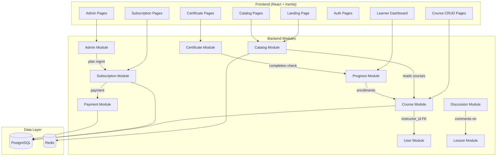
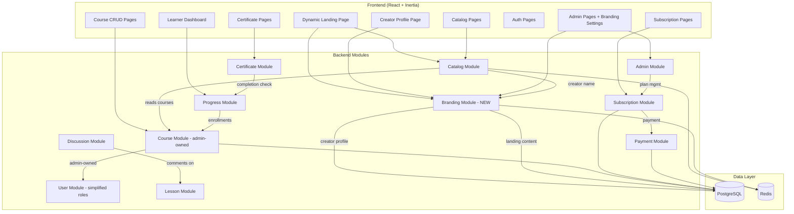
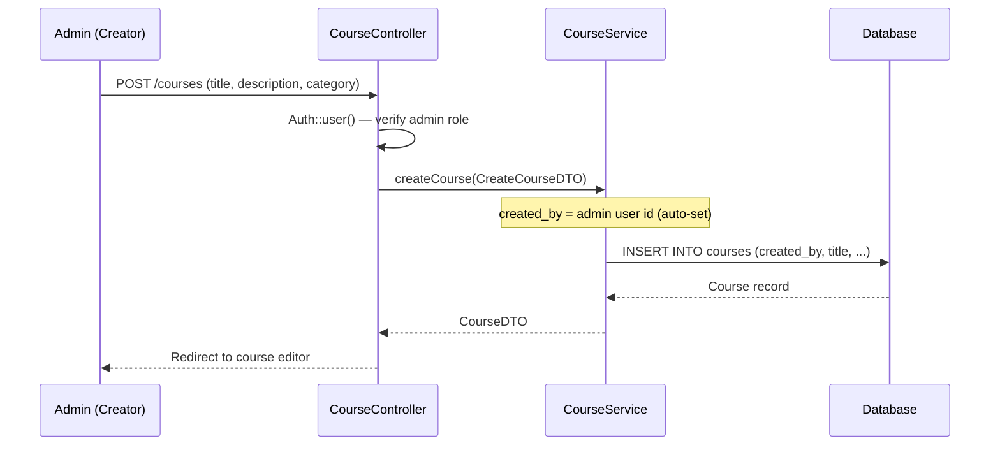
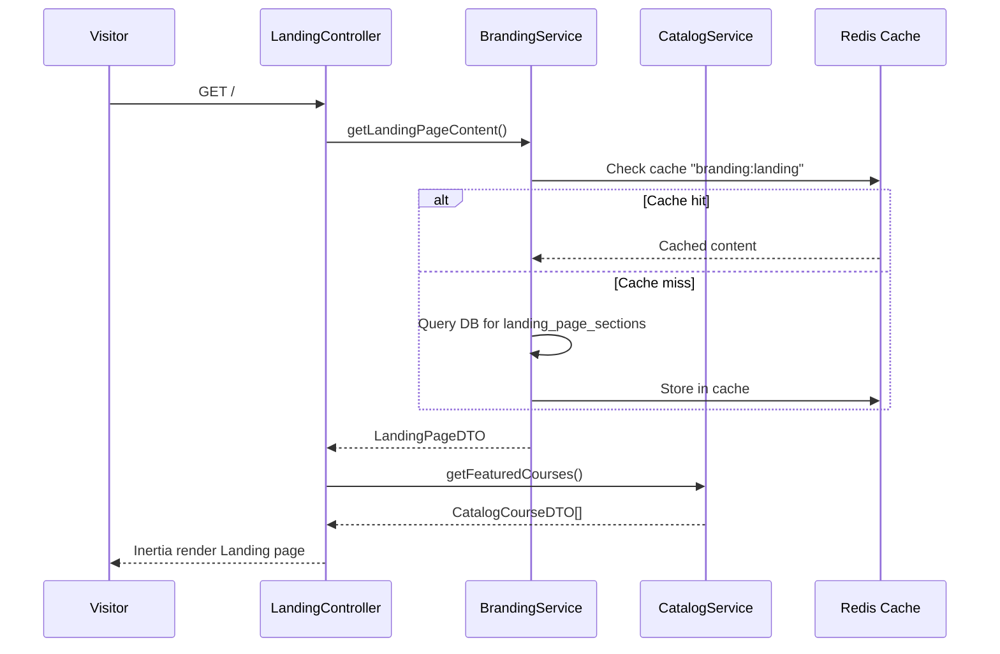
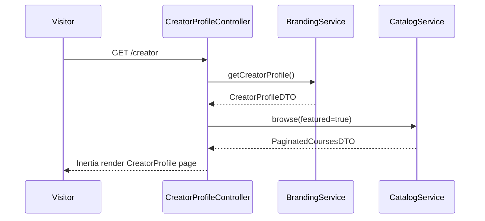
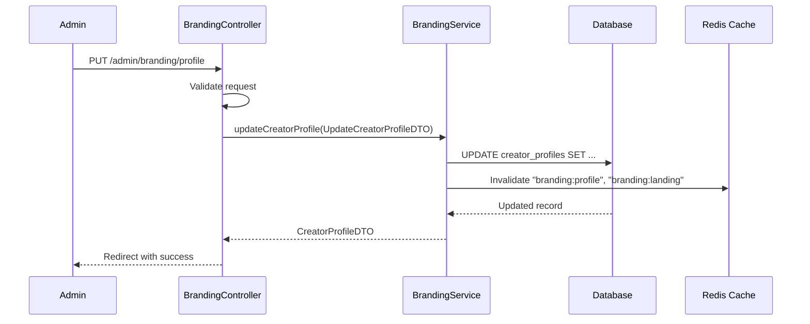

# Design Document: Personal Branding Hub Pivot

## Overview

GrowthPedia is currently a multi-instructor LMS platform where multiple instructors can create and manage courses. This pivot transforms it into a **Personal Branding Learning Hub** — a single-creator platform where ONE admin (the creator) builds a personal brand, publishes courses, and monetizes knowledge through subscriptions.

The pivot involves three categories of work: (1) removing the instructor role and multi-instructor ownership logic, (2) simplifying course ownership so all courses belong to the admin/creator, and (3) adding new branding features — a Creator Profile page, a customizable Landing Page, and a platform-wide Branding Layer. The existing modular monolith architecture (`app/Modules`) is preserved, with no microservices introduced and no module boundaries broken.

The design is organized into three execution phases: Phase 1 adds new modules and features non-destructively alongside existing code; Phase 2 removes the instructor role and simplifies ownership; Phase 3 wires the new Creator Profile, Landing Page, and Branding Layer into the platform.

## Architecture

### Current Architecture (Before Pivot)



### Target Architecture (After Pivot)



### Key Architectural Changes

1. **New Branding Module** (`app/Modules/Branding`): Owns creator profile, landing page content, and platform branding settings
2. **Course Module**: `instructor_id` column replaced with `created_by` referencing the admin user; ownership checks simplified
3. **User Module**: Role enum reduced from `['learner', 'instructor', 'admin']` to `['learner', 'admin']`
4. **Catalog Module**: Reads creator name from Branding module instead of per-course instructor relationship
5. **Admin Module**: Extended with branding management routes and controllers

## Sequence Diagrams

### Course Creation Flow (After Pivot)



### Landing Page Rendering Flow



### Creator Profile View Flow



### Branding Settings Update Flow



## Components and Interfaces

### New Component: Branding Module

**Purpose**: Manages all creator branding data — profile, landing page content, and platform-wide branding settings. Acts as the single source of truth for creator identity across the platform.

**Interface**:

```php
<?php

declare(strict_types=1);

namespace App\Modules\Branding\Contracts;

use App\Modules\Branding\DTOs\CreatorProfileDTO;
use App\Modules\Branding\DTOs\LandingPageDTO;
use App\Modules\Branding\DTOs\PlatformBrandingDTO;
use App\Modules\Branding\DTOs\UpdateCreatorProfileDTO;
use App\Modules\Branding\DTOs\UpdateLandingPageDTO;
use App\Modules\Branding\DTOs\UpdatePlatformBrandingDTO;
use App\Shared\Contracts\ServiceInterface;

interface BrandingServiceInterface extends ServiceInterface
{
    public function getCreatorProfile(): CreatorProfileDTO;

    public function updateCreatorProfile(UpdateCreatorProfileDTO $dto): CreatorProfileDTO;

    public function getLandingPageContent(): LandingPageDTO;

    public function updateLandingPageContent(UpdateLandingPageDTO $dto): LandingPageDTO;

    public function getPlatformBranding(): PlatformBrandingDTO;

    public function updatePlatformBranding(UpdatePlatformBrandingDTO $dto): PlatformBrandingDTO;

    public function getCreatorName(): string;
}
```

**Responsibilities**:
- CRUD operations for creator profile (bio, social links, expertise, avatar)
- CRUD operations for landing page sections (hero, about, featured courses, testimonials)
- Platform branding settings (site name, tagline, logo, primary color, footer text)
- Cache management for branding data (invalidate on update)
- Provide creator name to other modules (Catalog, Certificate) via service interface

### Modified Component: Course Module

**Purpose**: Course CRUD remains the same, but ownership is simplified — all courses belong to the admin/creator.

**Updated Interface**:

```php
<?php

declare(strict_types=1);

namespace App\Modules\Course\Contracts;

use App\Modules\Course\DTOs\CourseDetailDTO;
use App\Modules\Course\DTOs\CourseDTO;
use App\Modules\Course\DTOs\CreateCourseDTO;
use App\Modules\Course\DTOs\CreateLessonDTO;
use App\Modules\Course\DTOs\CreateModuleDTO;
use App\Modules\Course\DTOs\LessonDTO;
use App\Modules\Course\DTOs\ModuleDTO;
use App\Modules\Course\DTOs\UpdateCourseDTO;
use App\Shared\Contracts\ServiceInterface;

interface CourseServiceInterface extends ServiceInterface
{
    // CreateCourseDTO no longer has instructorId
    public function createCourse(CreateCourseDTO $dto): CourseDTO;

    public function updateCourse(int $courseId, UpdateCourseDTO $dto): CourseDTO;

    public function publishCourse(int $courseId): CourseDTO;

    public function unpublishCourse(int $courseId): void;

    public function addModule(int $courseId, CreateModuleDTO $dto): ModuleDTO;

    public function addLesson(int $moduleId, CreateLessonDTO $dto): LessonDTO;

    public function getCourseWithStructure(int $courseId): CourseDetailDTO;

    public function deleteLessonFromPublishedCourse(int $lessonId): void;
}
```

**Key Changes**:
- `CreateCourseDTO` drops `instructorId` field; `created_by` is auto-set from `Auth::user()->id`
- `CourseDTO` replaces `instructorId` with `createdBy`
- `CourseDetailDTO` drops `instructorId` and `instructorName` (creator name comes from Branding module)
- `CoursePolicy` simplified: only admin role check, no instructor ownership check

### Modified Component: User Module

**Purpose**: User registration and authentication remain the same, but the role system is simplified.

**Key Changes**:
- `VALID_ROLES` reduced from `['learner', 'instructor', 'admin']` to `['learner', 'admin']`
- `AssignRoleRequest` validation updated to `'in:learner,admin'`
- Registration still defaults to `'learner'` role

### Modified Component: Catalog Module

**Purpose**: Public course browsing remains the same, but instructor references are replaced with creator branding.

**Key Changes**:
- `CatalogCourseDTO`: `instructorName` renamed to `creatorName`, sourced from Branding module
- `CatalogCourseDetailDTO`: `instructorName` → `creatorName`, `instructorBio` → `creatorBio`, sourced from Branding module
- `CatalogService`: No longer eager-loads `instructor` relationship; fetches creator name from `BrandingServiceInterface`

## Data Models

### New Table: `creator_profiles`

```php
Schema::create('creator_profiles', function (Blueprint $table) {
    $table->id();
    $table->foreignId('user_id')->unique()->constrained('users');
    $table->string('display_name', 255);
    $table->text('bio')->nullable();
    $table->string('avatar_url', 500)->nullable();
    $table->string('expertise', 255)->nullable();
    $table->json('social_links')->nullable();
    // social_links structure: {"twitter": "...", "linkedin": "...", "youtube": "...", "website": "..."}
    $table->json('featured_course_ids')->nullable();
    $table->timestamps();
});
```

**Validation Rules**:
- `user_id` must reference an admin user (enforced at application level)
- `display_name` is required, max 255 characters
- `bio` is optional, max 5000 characters
- `avatar_url` is optional, must be a valid URL, max 500 characters
- `social_links` is optional, must be valid JSON with known keys
- `featured_course_ids` is optional, must be array of valid published course IDs

### New Table: `landing_page_sections`

```php
Schema::create('landing_page_sections', function (Blueprint $table) {
    $table->id();
    $table->string('section_type', 50);
    // section_type: 'hero', 'about', 'featured_courses', 'testimonials', 'cta'
    $table->string('title', 255)->nullable();
    $table->text('subtitle')->nullable();
    $table->text('content')->nullable();
    $table->string('image_url', 500)->nullable();
    $table->string('cta_text', 100)->nullable();
    $table->string('cta_url', 500)->nullable();
    $table->integer('sort_order')->default(0);
    $table->boolean('is_visible')->default(true);
    $table->json('metadata')->nullable();
    $table->timestamps();
});
```

**Validation Rules**:
- `section_type` is required, must be one of: `hero`, `about`, `featured_courses`, `testimonials`, `cta`
- `sort_order` determines display order on the landing page
- `is_visible` allows hiding sections without deleting them
- `metadata` stores section-specific extra data (e.g., testimonial author names)

### New Table: `platform_brandings`

```php
Schema::create('platform_brandings', function (Blueprint $table) {
    $table->id();
    $table->string('site_name', 255)->default('GrowthPedia');
    $table->string('tagline', 500)->nullable();
    $table->string('logo_url', 500)->nullable();
    $table->string('favicon_url', 500)->nullable();
    $table->string('primary_color', 7)->default('#3B82F6');
    // hex color code
    $table->string('secondary_color', 7)->default('#1E40AF');
    $table->text('footer_text')->nullable();
    $table->json('metadata')->nullable();
    $table->timestamps();
});
```

**Validation Rules**:
- Only one row should exist (singleton pattern, enforced at application level)
- `site_name` is required, max 255 characters
- `primary_color` and `secondary_color` must be valid hex color codes
- `logo_url` and `favicon_url` must be valid URLs if provided

### Modified Table: `courses`

**Migration**: Rename `instructor_id` to `created_by`

```php
// Migration: rename_instructor_id_to_created_by_on_courses_table
Schema::table('courses', function (Blueprint $table) {
    $table->renameColumn('instructor_id', 'created_by');
});
```

**Validation Rules**:
- `created_by` must reference a user with `role = 'admin'`
- All existing `instructor_id` values are preserved during rename (data-safe migration)

### Modified Table: `users`

**Migration**: Remove `instructor` from role enum

```php
// Migration: remove_instructor_role_from_users_table
// Step 1: Reassign any instructor users to admin
DB::table('users')->where('role', 'instructor')->update(['role' => 'admin']);

// Step 2: Alter the enum (PostgreSQL approach)
DB::statement("ALTER TABLE users DROP CONSTRAINT IF EXISTS users_role_check");
DB::statement("ALTER TABLE users ADD CONSTRAINT users_role_check CHECK (role IN ('learner', 'admin'))");
```

### New Model: CreatorProfile

```php
<?php

declare(strict_types=1);

namespace App\Modules\Branding\Models;

use App\Models\User;
use Illuminate\Database\Eloquent\Model;
use Illuminate\Database\Eloquent\Relations\BelongsTo;

class CreatorProfile extends Model
{
    protected $fillable = [
        'user_id',
        'display_name',
        'bio',
        'avatar_url',
        'expertise',
        'social_links',
        'featured_course_ids',
    ];

    protected function casts(): array
    {
        return [
            'social_links' => 'array',
            'featured_course_ids' => 'array',
        ];
    }

    public function user(): BelongsTo
    {
        return $this->belongsTo(User::class);
    }
}
```

### New Model: LandingPageSection

```php
<?php

declare(strict_types=1);

namespace App\Modules\Branding\Models;

use Illuminate\Database\Eloquent\Model;

class LandingPageSection extends Model
{
    protected $fillable = [
        'section_type',
        'title',
        'subtitle',
        'content',
        'image_url',
        'cta_text',
        'cta_url',
        'sort_order',
        'is_visible',
        'metadata',
    ];

    protected function casts(): array
    {
        return [
            'sort_order' => 'integer',
            'is_visible' => 'boolean',
            'metadata' => 'array',
        ];
    }
}
```

### New Model: PlatformBranding

```php
<?php

declare(strict_types=1);

namespace App\Modules\Branding\Models;

use Illuminate\Database\Eloquent\Model;

class PlatformBranding extends Model
{
    protected $fillable = [
        'site_name',
        'tagline',
        'logo_url',
        'favicon_url',
        'primary_color',
        'secondary_color',
        'footer_text',
        'metadata',
    ];

    protected function casts(): array
    {
        return [
            'metadata' => 'array',
        ];
    }
}
```


## Algorithmic Pseudocode

### Algorithm: Instructor Role Migration

```pascal
ALGORITHM migrateInstructorRole()
INPUT: none (operates on database state)
OUTPUT: all instructor users promoted to admin, courses re-linked

BEGIN
  // Step 1: Identify all instructor users
  instructorUsers ← SELECT * FROM users WHERE role = 'instructor'
  
  // Step 2: Promote each instructor to admin
  FOR EACH user IN instructorUsers DO
    ASSERT user.role = 'instructor'
    UPDATE users SET role = 'admin' WHERE id = user.id
    ASSERT user.role = 'admin' (after refresh)
  END FOR
  
  // Step 3: Rename instructor_id column to created_by
  ALTER TABLE courses RENAME COLUMN instructor_id TO created_by
  
  // Step 4: Update role enum constraint
  ALTER TABLE users DROP CONSTRAINT users_role_check
  ALTER TABLE users ADD CONSTRAINT users_role_check CHECK (role IN ('learner', 'admin'))
  
  // Step 5: Verify integrity
  orphanedCourses ← SELECT * FROM courses WHERE created_by NOT IN (SELECT id FROM users)
  ASSERT orphanedCourses IS EMPTY
  
  instructorUsers ← SELECT * FROM users WHERE role = 'instructor'
  ASSERT instructorUsers IS EMPTY
END
```

**Preconditions:**
- Database is accessible and migrations can run
- No active transactions modifying users or courses concurrently

**Postconditions:**
- Zero users with role = 'instructor' exist
- All courses have valid `created_by` references to admin users
- Role enum constraint only allows 'learner' and 'admin'

### Algorithm: Creator Profile Initialization

```pascal
ALGORITHM initializeCreatorProfile(adminUserId)
INPUT: adminUserId — the ID of the admin user
OUTPUT: CreatorProfileDTO

BEGIN
  ASSERT EXISTS(SELECT 1 FROM users WHERE id = adminUserId AND role = 'admin')
  
  existingProfile ← SELECT * FROM creator_profiles WHERE user_id = adminUserId
  
  IF existingProfile IS NOT NULL THEN
    RETURN toCreatorProfileDTO(existingProfile)
  END IF
  
  adminUser ← SELECT * FROM users WHERE id = adminUserId
  
  newProfile ← INSERT INTO creator_profiles (
    user_id: adminUserId,
    display_name: adminUser.name,
    bio: NULL,
    avatar_url: NULL,
    expertise: NULL,
    social_links: NULL,
    featured_course_ids: NULL
  )
  
  ASSERT newProfile.id IS NOT NULL
  ASSERT newProfile.user_id = adminUserId
  
  RETURN toCreatorProfileDTO(newProfile)
END
```

**Preconditions:**
- `adminUserId` references a valid user with role = 'admin'

**Postconditions:**
- Exactly one `creator_profiles` row exists for the given admin user
- If profile already existed, it is returned unchanged
- If profile was created, `display_name` defaults to the admin user's name

### Algorithm: Landing Page Content Assembly

```pascal
ALGORITHM assembleLandingPage()
INPUT: none
OUTPUT: LandingPageDTO containing all visible sections and featured courses

BEGIN
  // Step 1: Get platform branding
  branding ← SELECT * FROM platform_brandings LIMIT 1
  IF branding IS NULL THEN
    branding ← DEFAULT_BRANDING
  END IF
  
  // Step 2: Get visible landing page sections, ordered
  sections ← SELECT * FROM landing_page_sections 
    WHERE is_visible = true 
    ORDER BY sort_order ASC
  
  // Step 3: Get creator profile
  creatorProfile ← SELECT * FROM creator_profiles LIMIT 1
  
  // Step 4: Get featured courses
  IF creatorProfile IS NOT NULL AND creatorProfile.featured_course_ids IS NOT EMPTY THEN
    featuredCourses ← SELECT * FROM courses 
      WHERE id IN creatorProfile.featured_course_ids 
      AND status = 'published'
      ORDER BY published_at DESC
  ELSE
    // Fallback: latest 6 published courses
    featuredCourses ← SELECT * FROM courses 
      WHERE status = 'published' 
      ORDER BY published_at DESC 
      LIMIT 6
  END IF
  
  // Step 5: Assemble DTO
  RETURN LandingPageDTO(
    branding: toBrandingDTO(branding),
    sections: sections.map(toSectionDTO),
    creatorProfile: toCreatorProfileDTO(creatorProfile),
    featuredCourses: featuredCourses.map(toCatalogCourseDTO)
  )
END
```

**Preconditions:**
- Database is accessible
- At least default branding values exist

**Postconditions:**
- Returns a complete LandingPageDTO with all visible sections
- Featured courses are all published
- Sections are ordered by `sort_order`

**Loop Invariants:**
- All sections in the result have `is_visible = true`
- All featured courses have `status = 'published'`

### Algorithm: Course Creation (Simplified)

```pascal
ALGORITHM createCourse(adminUser, title, description, category)
INPUT: adminUser (authenticated admin), title, description, category
OUTPUT: CourseDTO

BEGIN
  ASSERT adminUser.role = 'admin'
  ASSERT title IS NOT EMPTY AND length(title) <= 255
  ASSERT description IS NOT EMPTY
  ASSERT category IS NOT EMPTY AND length(category) <= 100
  
  course ← INSERT INTO courses (
    created_by: adminUser.id,
    title: title,
    description: description,
    category: category,
    status: 'draft',
    published_at: NULL
  )
  
  ASSERT course.id IS NOT NULL
  ASSERT course.created_by = adminUser.id
  ASSERT course.status = 'draft'
  
  RETURN toCourseDTO(course)
END
```

**Preconditions:**
- `adminUser` is authenticated and has role = 'admin'
- `title`, `description`, `category` pass validation

**Postconditions:**
- New course exists with `status = 'draft'`
- `created_by` equals the admin user's ID
- No side effects on other tables

## Key Functions with Formal Specifications

### Function: BrandingService::getCreatorProfile()

```php
public function getCreatorProfile(): CreatorProfileDTO
```

**Preconditions:**
- At least one user with `role = 'admin'` exists in the system

**Postconditions:**
- Returns a `CreatorProfileDTO` with valid data
- If no profile exists yet, creates one with defaults from the admin user
- Result is cached for subsequent calls

### Function: BrandingService::updateCreatorProfile()

```php
public function updateCreatorProfile(UpdateCreatorProfileDTO $dto): CreatorProfileDTO
```

**Preconditions:**
- `$dto` contains at least one non-null field to update
- If `featured_course_ids` is provided, all IDs must reference published courses

**Postconditions:**
- Creator profile is updated with provided fields
- Cache keys `branding:profile` and `branding:landing` are invalidated
- Returns the updated `CreatorProfileDTO`
- Fields not provided in `$dto` remain unchanged

### Function: BrandingService::getLandingPageContent()

```php
public function getLandingPageContent(): LandingPageDTO
```

**Preconditions:**
- None (gracefully handles empty state)

**Postconditions:**
- Returns `LandingPageDTO` with all visible sections ordered by `sort_order`
- Featured courses are all published
- Result is cached with TTL of 300 seconds

### Function: CourseService::createCourse() (Modified)

```php
public function createCourse(CreateCourseDTO $dto): CourseDTO
```

**Preconditions:**
- `$dto->title` is non-empty, max 255 characters
- `$dto->description` is non-empty
- `$dto->category` is non-empty, max 100 characters
- Authenticated user has `role = 'admin'`

**Postconditions:**
- New course record created with `status = 'draft'`
- `created_by` set to the authenticated admin user's ID
- Returns `CourseDTO` with the new course data

### Function: CoursePolicy::update() (Simplified)

```php
public function update(User $user, Course $course): bool
```

**Preconditions:**
- `$user` is an authenticated user
- `$course` is a valid course record

**Postconditions:**
- Returns `true` if and only if `$user->role === 'admin'`
- No instructor ownership check (removed)

## Example Usage

### Creating a Course (Admin Only)

```php
// CourseController::store() — simplified
public function store(CreateCourseRequest $request): RedirectResponse
{
    $user = Auth::user();

    $dto = new CreateCourseDTO(
        title: $request->validated('title'),
        description: $request->validated('description'),
        category: $request->validated('category'),
    );

    $course = $this->courseService->createCourse($dto);

    return redirect()->route('courses.edit', $course->id)
        ->with('success', 'Course created successfully.');
}

// CourseService::createCourse() — auto-sets created_by
public function createCourse(CreateCourseDTO $dto): CourseDTO
{
    $course = Course::create([
        'created_by' => Auth::id(),
        'title' => $dto->title,
        'description' => $dto->description,
        'category' => $dto->category,
        'status' => 'draft',
    ]);

    return $this->toCourseDTO($course);
}
```

### Updating Creator Profile

```php
// BrandingController::updateProfile()
public function updateProfile(UpdateCreatorProfileRequest $request): RedirectResponse
{
    $dto = new UpdateCreatorProfileDTO(
        displayName: $request->validated('display_name'),
        bio: $request->validated('bio'),
        avatarUrl: $request->validated('avatar_url'),
        expertise: $request->validated('expertise'),
        socialLinks: $request->validated('social_links'),
        featuredCourseIds: $request->validated('featured_course_ids'),
    );

    $this->brandingService->updateCreatorProfile($dto);

    return redirect()->back()->with('success', 'Creator profile updated.');
}
```

### Rendering the Landing Page

```typescript
// resources/js/Pages/Landing.tsx — updated
interface LandingProps {
  branding: PlatformBranding;
  sections: LandingPageSection[];
  creatorProfile: CreatorProfile;
  featuredCourses: CatalogCourse[];
}

export default function Landing({ branding, sections, creatorProfile, featuredCourses }: LandingProps) {
  return (
    <div>
      {sections.map((section) => (
        <LandingSection key={section.id} section={section} branding={branding} />
      ))}
      <FeaturedCourses courses={featuredCourses} creatorName={creatorProfile.displayName} />
    </div>
  );
}
```

### Simplified Course Policy

```php
// CoursePolicy — after pivot
class CoursePolicy
{
    public function create(User $user): bool
    {
        return $user->role === 'admin';
    }

    public function update(User $user, Course $course): bool
    {
        return $user->role === 'admin';
    }

    public function publish(User $user, Course $course): bool
    {
        return $user->role === 'admin';
    }

    public function delete(User $user, Course $course): bool
    {
        if ($course->status !== 'draft') {
            return false;
        }
        return $user->role === 'admin';
    }
}
```

## Correctness Properties

The following properties must hold true after the pivot is complete:

1. **∀ course ∈ courses: course.created_by references a user with role = 'admin'**
   No course should reference a non-admin user after migration.

2. **∀ user ∈ users: user.role ∈ {'learner', 'admin'}**
   No user should have the 'instructor' role after migration.

3. **∀ section ∈ landing_page_sections: section.sort_order is unique within visible sections**
   Landing page sections should have deterministic ordering.

4. **|creator_profiles| ≤ 1**
   At most one creator profile exists in the system (single-creator platform).

5. **|platform_brandings| ≤ 1**
   At most one platform branding record exists (singleton).

6. **∀ course ∈ featured_courses: course.status = 'published'**
   Featured courses on the landing page and creator profile must be published.

7. **CoursePolicy.create(user) = true ⟹ user.role = 'admin'**
   Only admin users can create courses.

8. **CoursePolicy.update(user, course) = true ⟹ user.role = 'admin'**
   Only admin users can update any course (no per-instructor ownership).

9. **Cache invalidation: after any branding update, subsequent reads return updated data**
   Branding cache must be invalidated on every write operation.

10. **Subscription and Payment modules remain unchanged**
    No modifications to subscription logic, payment processing, or revenue model.

## Error Handling

### Error Scenario 1: No Admin User Exists During Profile Initialization

**Condition**: `BrandingService::getCreatorProfile()` is called but no user with `role = 'admin'` exists
**Response**: Throw `EntityNotFoundException` with message "No admin user found. Please create an admin account first."
**Recovery**: Admin must be seeded or created via CLI before branding features work

### Error Scenario 2: Featured Course ID References Non-Published Course

**Condition**: `UpdateCreatorProfileDTO.featuredCourseIds` contains an ID for a draft or unpublished course
**Response**: Throw `ValidationException` with message "Featured courses must be published."
**Recovery**: Admin removes the unpublished course ID from featured list, or publishes the course first

### Error Scenario 3: Migration Encounters Orphaned Courses

**Condition**: During `instructor_id → created_by` rename, some courses reference deleted users
**Response**: Migration logs a warning and assigns orphaned courses to the first admin user
**Recovery**: Admin reviews reassigned courses after migration

### Error Scenario 4: Duplicate Creator Profile Creation (Race Condition)

**Condition**: Two concurrent requests try to create a creator profile for the same admin
**Response**: Database unique constraint on `user_id` prevents duplicate; second request catches `QueryException`
**Recovery**: Second request fetches the existing profile instead of creating

### Error Scenario 5: Landing Page With No Sections

**Condition**: `getLandingPageContent()` called when no sections exist in database
**Response**: Returns `LandingPageDTO` with empty sections array and default branding
**Recovery**: Admin creates landing page sections via branding settings

## Testing Strategy

### Unit Testing Approach

- **BrandingService**: Test CRUD operations for creator profile, landing page sections, and platform branding
- **CourseService (modified)**: Test that `createCourse` no longer requires `instructorId`, auto-sets `created_by`
- **CoursePolicy (simplified)**: Test that only admin role passes all policy checks
- **UserService (modified)**: Test that `VALID_ROLES` no longer includes 'instructor'
- **CatalogService (modified)**: Test that creator name comes from BrandingService, not course.instructor

**Coverage Goals**: 90%+ line coverage for BrandingService, 100% for CoursePolicy

### Property-Based Testing Approach

**Property Test Library**: Eris (already in project dependencies)

- **Property 1**: For any valid `UpdateCreatorProfileDTO`, updating and then reading the profile returns the updated values
- **Property 2**: For any set of landing page sections with unique sort_orders, `getLandingPageContent()` returns them in ascending sort_order
- **Property 3**: For any user with role ≠ 'admin', all CoursePolicy methods return false
- **Property 4**: For any course created after migration, `created_by` always references an admin user
- **Property 5**: Cache invalidation — after any branding update, the next read returns fresh data (not stale cache)

### Integration Testing Approach

- **Migration test**: Run the instructor→admin migration on a seeded database, verify zero instructors remain and all courses have valid `created_by`
- **Landing page end-to-end**: Seed branding data, hit `GET /`, verify Inertia response contains correct sections and featured courses
- **Creator profile flow**: Create profile via admin route, verify it appears on `GET /creator`
- **Course creation flow**: Verify admin can create courses, learner cannot
- **Role assignment**: Verify admin can only assign 'learner' or 'admin' roles

## Performance Considerations

1. **Branding data caching**: All branding reads (profile, landing page, platform branding) are cached in Redis with 5-minute TTL. Cache is invalidated on writes. This prevents repeated DB queries for data that changes infrequently.

2. **Landing page assembly**: The landing page combines data from 3 tables (platform_brandings, landing_page_sections, creator_profiles) plus featured courses. The assembled result is cached as a single key to avoid multiple queries per page load.

3. **Catalog module**: Currently eager-loads `instructor` relationship on every course query. After pivot, this eager-load is removed (creator name comes from cached branding data), reducing query complexity.

4. **Migration performance**: The `instructor_id → created_by` column rename is a metadata-only operation in PostgreSQL (no table rewrite). The role enum update requires a constraint drop/add but no data scan beyond the instructor→admin UPDATE.

## Security Considerations

1. **Admin-only branding access**: All branding management routes are behind `auth` + `admin` middleware. No public write access to branding data.

2. **Input validation**: All branding DTOs validate URLs (avatar, logo, image URLs) to prevent XSS via malicious URLs. Social links are validated against a whitelist of known keys.

3. **Color code validation**: Primary and secondary colors are validated as hex codes (`/^#[0-9A-Fa-f]{6}$/`) to prevent injection.

4. **File upload security**: Avatar and logo uploads (if implemented) should go through Laravel's file validation with mime type checks and size limits. URLs stored in the database should be sanitized.

5. **Single-creator enforcement**: The `creator_profiles` table has a unique constraint on `user_id`, and application logic ensures only one profile exists. This prevents privilege escalation where multiple users claim creator status.

## Dependencies

### Existing Dependencies (No Changes)
- Laravel 13 (framework)
- Inertia.js 3 (SPA bridge)
- React 19 + TypeScript 6 (frontend)
- Tailwind CSS 4 (styling)
- PostgreSQL (database)
- Redis (cache/queue)
- Stripe SDK (payment gateway)
- Pest + PHPUnit + Eris (testing)

### New Dependencies
- None required. All new features use existing Laravel, Inertia, and React capabilities.

---

## Phased Execution Plan

### Phase 1: Non-Breaking Additions (Add New Alongside Existing)

**Goal**: Add the Branding module and new database tables without modifying any existing code.

1. Create `app/Modules/Branding` module structure (Models, Contracts, Services, Controllers, DTOs, Routes, Providers, Requests)
2. Create migrations for `creator_profiles`, `landing_page_sections`, `platform_brandings` tables
3. Implement `BrandingServiceInterface` and `BrandingService`
4. Add admin routes for branding management (`/admin/branding/*`)
5. Create frontend pages: `Admin/BrandingSettings.tsx`, `Admin/CreatorProfileEdit.tsx`, `Admin/LandingPageEditor.tsx`
6. Create `CreatorProfile.tsx` public page at `/creator`
7. Write unit and integration tests for the Branding module

### Phase 2: Instructor Role Removal (Breaking Changes)

**Goal**: Remove the instructor role and simplify course ownership.

1. Create migration to promote all instructor users to admin
2. Create migration to rename `courses.instructor_id` → `courses.created_by`
3. Create migration to update users role enum constraint
4. Update `Course` model: rename relationship from `instructor()` to `creator()`
5. Update `CreateCourseDTO`: remove `instructorId` field
6. Update `CourseDTO` and `CourseDetailDTO`: replace `instructorId`/`instructorName` with `createdBy`
7. Update `CourseService::createCourse()`: auto-set `created_by` from `Auth::id()`
8. Simplify `CoursePolicy`: remove instructor ownership checks, admin-only
9. Update `CourseController::index()`: show all courses for admin (not filtered by instructor_id)
10. Update Course routes: change middleware from `role:instructor,admin` to `role:admin`
11. Update `UserService::VALID_ROLES`: remove 'instructor'
12. Update `AssignRoleRequest`: remove 'instructor' from validation
13. Update `CatalogService`: remove `instructor` eager-loading, use `BrandingServiceInterface::getCreatorName()`
14. Update `CatalogCourseDTO` and `CatalogCourseDetailDTO`: rename `instructorName` → `creatorName`
15. Update `AnalyticsService::getDashboardMetrics()`: no changes needed (counts learners, not instructors)
16. Update all affected frontend components and TypeScript types
17. Update all affected tests

### Phase 3: Landing Page and Branding Integration

**Goal**: Wire the new branding features into the public-facing platform.

1. Update `Landing.tsx` to use dynamic content from Branding module instead of static content
2. Create `LandingController` (or update existing route) to assemble landing page data from BrandingService + CatalogService
3. Add branding context (site name, logo, colors) to `HandleInertiaRequests` middleware shared data
4. Update Catalog pages to show creator name from branding instead of per-course instructor
5. Update Certificate templates to use creator name from branding
6. Create seeder for default branding data (platform_brandings, default landing page sections)
7. End-to-end testing of the complete flow
